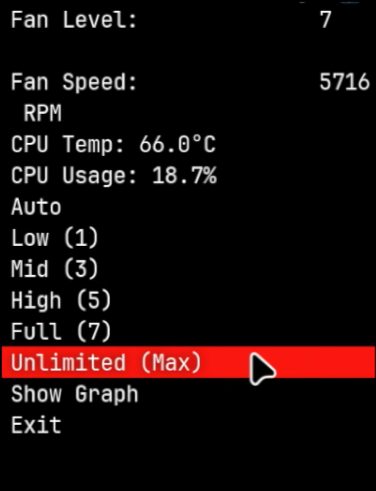

# ThinkPad Fan Controller

## Overview
This is a simple **GTK-based system tray application** for controlling and monitoring the **fan speed on ThinkPad laptops**.  
It retrieves **fan speed, CPU temperature**, and allows for **fan level adjustments** with real-time monitoring.


*You can replace this with your own screenshot by taking one and naming it 'screenshot.png'*

## Features
✅ Displays **fan speed, CPU temperature, and CPU utilization**  
✅ **Visual fan level indicator** with color-coded levels  
✅ **Temperature and CPU usage history graph** for monitoring trends  
✅ Integrates with the **system tray** using `libappindicator`  
✅ Reads data from `/proc/acpi/ibm/fan` (ThinkPad-specific ACPI interface)  
✅ No longer requires `sudo` for fan control after proper setup  

---

## 🛠 Requirements
This program is designed for **Linux systems**, specifically **Arch Linux** with **ThinkPad hardware**.  
It may work on other distributions with minor adjustments.

### 🔧 Dependencies
Install the required dependencies using **pacman**:

```sh
sudo pacman -S gtk3 libappindicator-gtk3 thinkfan acpi_call-dkms glibc
```

### ⚙️ Additional Kernel Module
Ensure the `thinkpad_acpi` kernel module is loaded:

```sh
sudo modprobe thinkpad_acpi
```

If necessary, **enable auto-loading** at startup:

```sh
echo "thinkpad_acpi" | sudo tee /etc/modules-load.d/thinkpad_acpi.conf
```

### 🔑 Fixing Permissions for `/proc/acpi/ibm/fan`
To allow the program to control fan speeds **without requiring sudo**, set proper permissions:

```sh
sudo groupadd thinkpad
sudo chown :thinkpad /proc/acpi/ibm/fan
sudo chmod 664 /proc/acpi/ibm/fan
sudo usermod -aG thinkpad $USER
```

Make this permission persist across reboots:
```sh
echo 'f /proc/acpi/ibm/fan 0664 root thinkpad' | sudo tee /etc/tmpfiles.d/thinkpadfan.conf
sudo systemd-tmpfiles --create
```

Reboot your system to apply the changes.

---

## 📥 Installation

### 1️⃣ Clone the repository:
```sh
git clone https://github.com/korzewarrior/thinkpadFanController.git
cd thinkpadFanController
```

### 2️⃣ Compile the program:
```sh
make clean
make
```

### 3️⃣ Install the application system-wide:
```sh
sudo make install
```

### 4️⃣ Run the application:
```sh
thinkpadFanController
```

✅ **No need for `sudo` if permissions were set correctly!**

---

## 🔧 System-wide Installation
To install it as a system-wide application:
```sh
sudo make install
```

To remove it:
```sh
sudo make uninstall
```

---

## 🚀 Usage
Run the program from the terminal:
```sh
thinkpadFanController
```
Or add it to your **startup applications** if using a window manager like **i3wm** or **LXQt**.

### Key Features
- **Fan Level Control**: Set your fan speed to Auto, Low (1), Mid (3), High (5), Full (7), or Unlimited (Max)
- **Visual Fan Indicator**: See your current fan level with an intuitive color-coded visualization
- **CPU Monitoring**: Track both CPU temperature and utilization in real-time
- **Temperature History**: Click "Show Graph" to view a history graph of temperature and CPU usage over time

### 🚀 Using with Hyprland
To use this application with Hyprland:

1. Ensure your Hyprland configuration supports system tray applications.

2. Add this application to your Hyprland autostart by editing your Hyprland config file (typically `~/.config/hypr/hyprland.conf`):

```
# Start ThinkPad Fan Controller
exec-once = thinkpadFanController-hyprland.sh
```

3. Make sure you have a status bar that supports XDG system tray (like Waybar) and it's configured correctly:

If using Waybar, make sure your Waybar config (typically `~/.config/waybar/config`) includes the "tray" module:

```json
{
    "modules-right": ["tray", "clock", ...],
    "tray": {
        "icon-size": 21,
        "spacing": 10
    }
}
```

4. If the tray icon doesn't appear, you may need to install `xdg-desktop-portal-wlr` and `xdg-desktop-portal-gtk`:

```sh
sudo pacman -S xdg-desktop-portal-wlr xdg-desktop-portal-gtk
```

5. The included `thinkpadFanController-hyprland.sh` script sets necessary environment variables for better compatibility with Hyprland. It's automatically installed by `make install`.

6. If you're migrating from i3wm to Hyprland, make sure to remove any i3-specific autostart entries for thinkpadFanController and use the Hyprland approach described above.

---

## 📜 License
This project is licensed under the **MIT License**.  
See the [`LICENSE`](./LICENSE) file for details.

---

## 🤝 Contributing
Feel free to **submit issues** or **pull requests** on **GitHub**!  

**⭐ If you find this useful, consider starring the repo!**  
